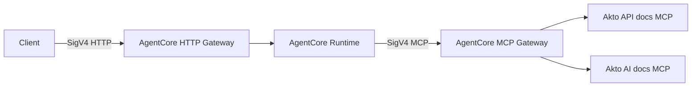

# AgentCore gateway-to-runtime demo

This repository deploys one architecture:



The Runtime's resource policy allows invocation only from the HTTP Gateway
role. Clients therefore cannot bypass the outer Gateway.

Akto interceptors are intentionally not bundled here. Deploy the topology
first, then follow the
[Akto Bedrock AgentCore connector guide](https://docs.akto.io/akto-argus-agentic-ai-security-for-homegrown-ai/connectors/ai-agent-security/aws-bedrock-agentcore)
to attach Akto to the HTTP and MCP Gateways.

## Prerequisites

- AWS CLI with authenticated credentials
- Terraform 1.10 or newer
- Docker with `buildx`
- Python 3
- Bedrock model access for
  `us.anthropic.claude-haiku-4-5-20251001-v1:0`
- An AWS region supporting AgentCore Runtime and Gateway (`us-east-1` by
  default)

Check the local tools and AWS credentials:

```bash
scripts/check_prereqs.sh
```

## Deploy

1. Create the Terraform state bucket and environment backend:

   ```bash
   scripts/bootstrap.sh us-east-1 agentcore-gateway-demo
   ```

2. Optionally copy and edit the deployment variables:

   ```bash
   cp infra/environments/akto-demo/terraform.tfvars.example \
      infra/environments/akto-demo/terraform.tfvars
   ```

3. Deploy the ECR image and complete topology:

   ```bash
   scripts/deploy.sh
   ```

The deploy script shows every Terraform plan for approval. It first creates
the ECR repository, builds and pushes the Runtime image for `linux/arm64`,
then creates both Gateways, the Runtime, MCP targets, and IAM policies.

## Call the agent

Use the outer HTTP Gateway; do not invoke the Runtime directly:

```bash
scripts/invoke.sh "What does API security testing cover in Akto?"
```

The script reads the Gateway URL, target name, and Runtime ARN from Terraform
outputs and uses the AWS CLI to make a SigV4-signed request through the HTTP
Gateway. The caller needs `bedrock-agentcore:InvokeGateway` on the HTTP
Gateway. Terraform outputs a ready-to-attach policy ARN:

```bash
terraform -chdir=infra/environments/akto-demo \
  output -raw http_gateway_invoke_policy_arn
```

Run the end-to-end smoke test:

```bash
scripts/smoke-test.sh
```

The test asks a documentation question that makes the Runtime use an MCP
tool, exercising the complete path.

## Install Akto interceptors

After deployment, get the two Gateway IDs:

```bash
terraform -chdir=infra/environments/akto-demo output -raw http_gateway_id
terraform -chdir=infra/environments/akto-demo output -raw mcp_gateway_id
```

Use those IDs in the
[Akto Bedrock AgentCore connector guide](https://docs.akto.io/akto-argus-agentic-ai-security-for-homegrown-ai/connectors/ai-agent-security/aws-bedrock-agentcore).
Attach REQUEST and RESPONSE interception to both Gateways:

- HTTP Gateway: guards user prompts and final agent responses.
- MCP Gateway: guards tool calls and tool results.

Run `scripts/smoke-test.sh` again after installation to verify the guarded
end-to-end path.

## Destroy

```bash
scripts/destroy.sh
```

This removes the deployed topology and ECR repository. It leaves the
Terraform state bucket intact.
